## 使用Bert做命名实体识别

[**中文命名实体识别NER的原理、方法与工具**](https://zhuanlan.zhihu.com/p/156914795)

###  1 bert 结构 transformer 及下游任务

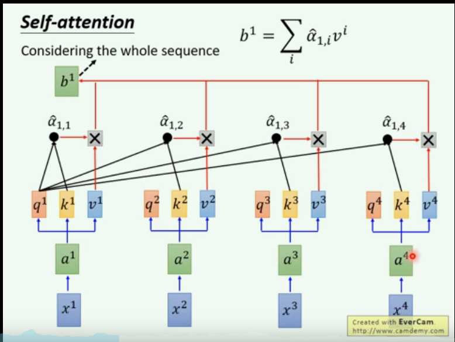

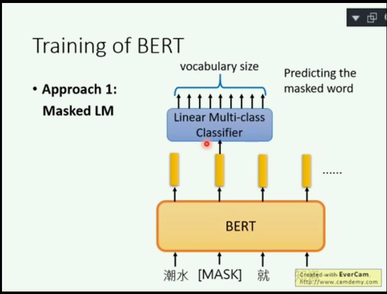

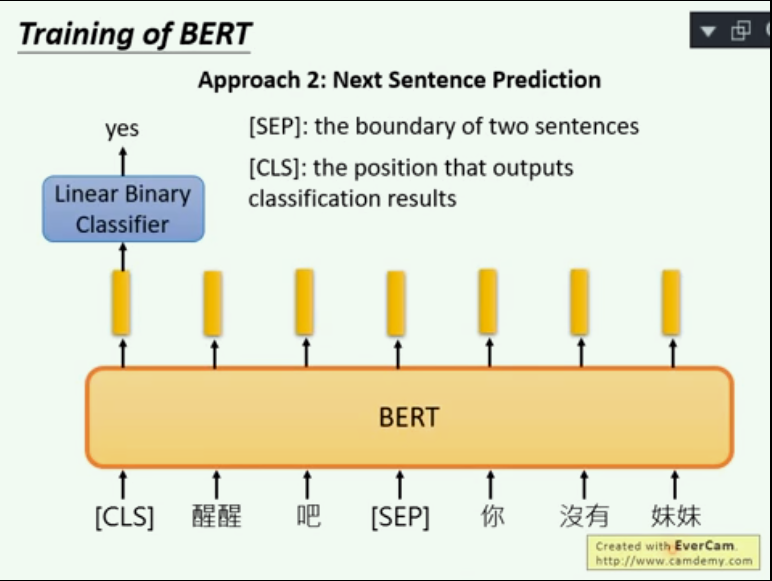

 

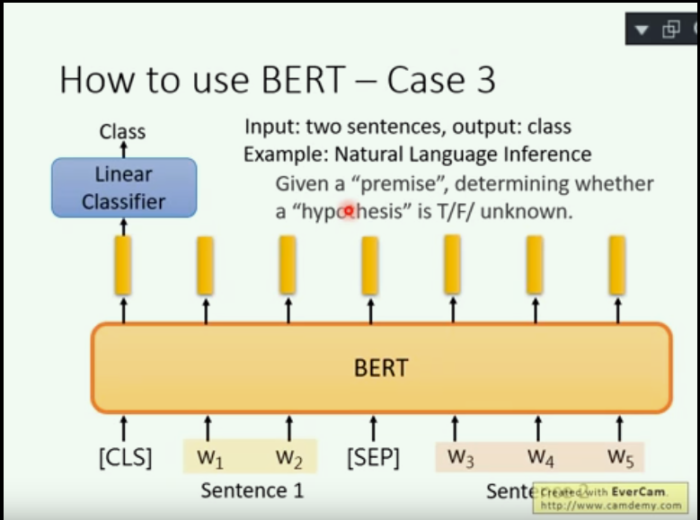

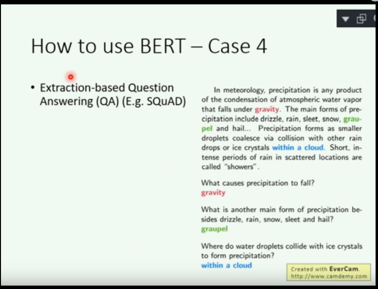

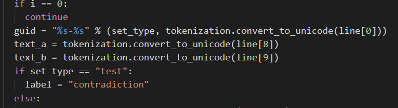

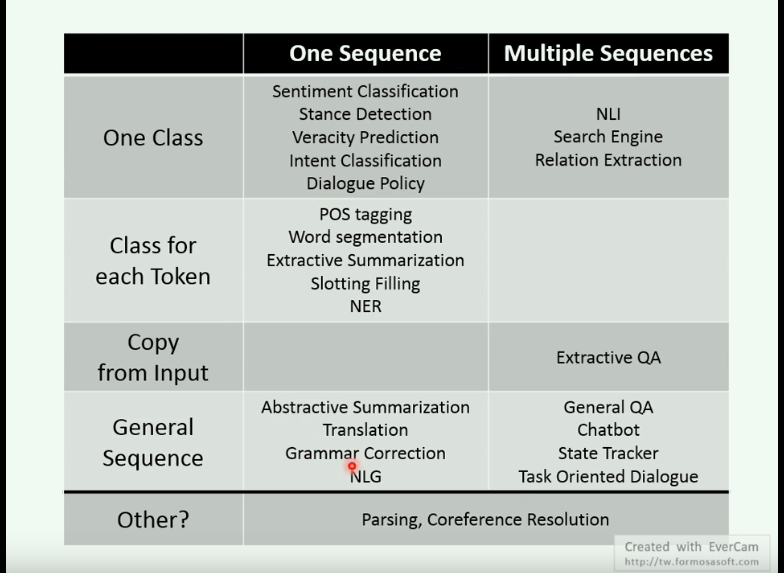


**transformer解决RNN的问题：顺序依赖，无法并行和单向信息流**

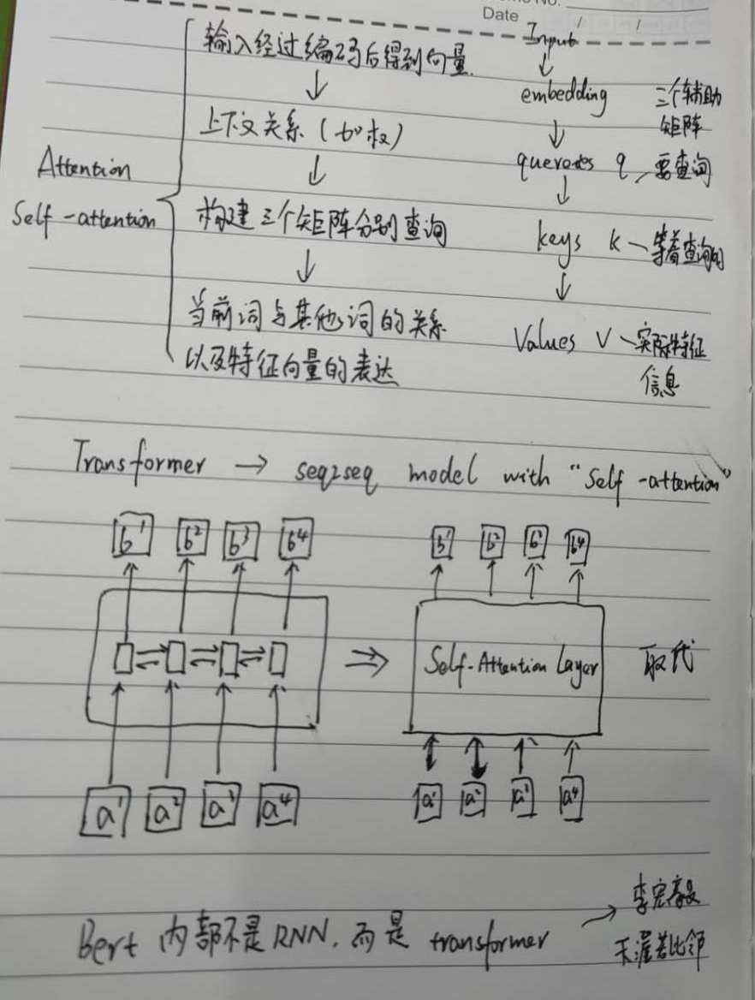

BERT 的全称是基于 Transformer 的双向编码器表征，其中「双向」表示模型在处理某一个词时，它能同时利用前面的词和后面的词两部分信息。这种「双向」的来源在于 BERT 与传统语言模型不同，它不是在给定所有前面词的条件下预测最可能的当前词，而是随机遮掩一些词，并利用所有没被遮掩的词进行预测。下图展示了三种型，其中 BERT 和 ELMo 都使用双向信息，OpenAI GPT 使用单向信息。

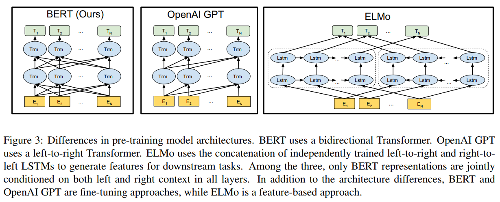

BERT 可以视为结合了 OpenAI GPT 和 ELMo 优势的新模型。其中 ELMo 使用两条独立训练的 LSTM 获取双向信息，而 OpenAI GPT 使用新型的 Transformer 和经典语言模型只能获取单向信息。BERT 的主要目标是在 OpenAI GPT 的基础上对预训练任务做一些改进，以同时利用 Transformer 深度模型与双向信息的优势。


### 2  **命名实体识别**
（Named Entity Recognition，**NER** ）是NLP中一项非常基础的任务。

NER是信息提取、问答系统、句法分析、机器翻译等众多NLP任务的重要基础工具。 

 鉴于BERT的强大，在下游任务中，引入BERT是很自然的想法。基于谷歌开源出来的BERT base模型，进行fine tune，做NER任务。 

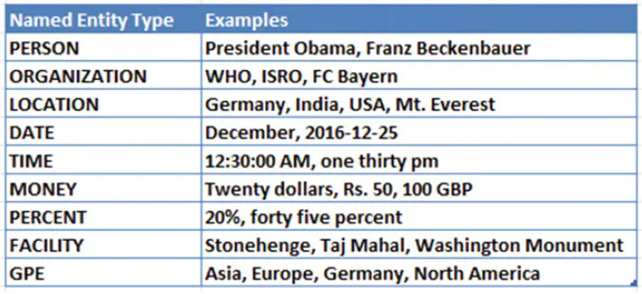

**命名实体识别的数据标注方式**

NER是一种序列标注问题，因此他们的数据标注方式也遵照序列标注问题的方式，主要是BIO和BIOES两种。这里直接介绍BIOES，明白了BIOES，BIO也就掌握了。

BIOES：

B，即Begin，表示开始

I，即Intermediate，表示中间

E，即End，表示结尾

S，即Single，表示单个字符

O，即Other，表示其他，用于标记无关字符

将“小明在北京大学的燕园看了中国男篮的一场比赛”这句话，进行标注，结果就是：

[B-PER，E-PER，O, B-ORG，I-ORG，I-ORG，E-ORG，O，B-LOC，E-LOC，O，O，B-ORG，I-ORG，I-ORG，E-ORG，O，O，O，O]

### 3 BERT源码

可以从google-research的github中获取：

https://github.com/google-research/bert

取BERT Chinese的预训练模型：

https://storage.googleapis.com/bert_models/2018_11_03/chinese_L-12_H-768_A-12.zip

对下载的压缩文件进行解压，可以看到文件里有五个文件，其中bert_model.ckpt开头的文件是负责模型变量载入的，而vocab.txt是训练时中文文本采用的字典，最后bert_config.json是BERT在训练时，可选调整的一些参数。

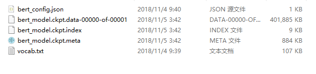

```python
{
"attention_probs_dropout_prob": 0.1, #乘法attention时，softmax后dropout概率 
"hidden_act": "gelu", #激活函数 
"hidden_dropout_prob": 0.1, #隐藏层dropout概率 
"hidden_size": 768, #隐藏单元数 
"initializer_range": 0.02, #初始化范围 
"intermediate_size": 3072, #升维维度
"max_position_embeddings": 512,#一个大于seq_length的参数，用于生成position_embedding "num_attention_heads": 12, #每个隐藏层中的attention head数 
"num_hidden_layers": 12, #隐藏层数 
"type_vocab_size": 2, #segment_ids类别 [0,1] 
"vocab_size": 30522 #词典中词数
}
```


BERT的代码主要分为两个部分：

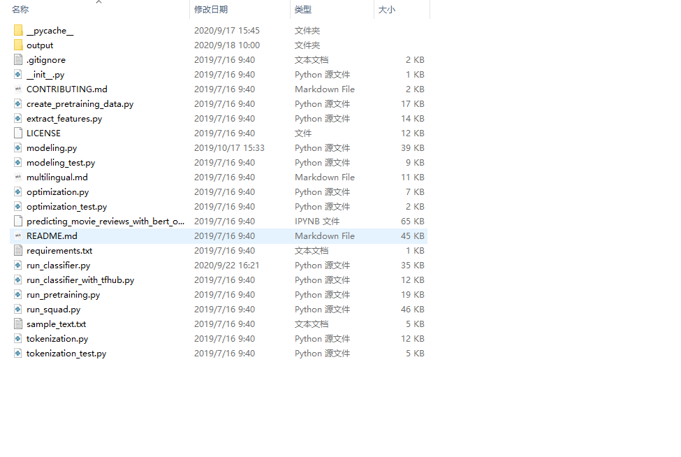

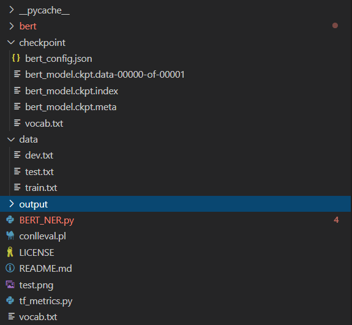

1.**`预训练部分`**，其入口是在run_pretraining.py。

2.**`Fine-tune部分`**。Fine-tune的入口针对不同的任务分别在run_classifier.py和run_squad.py。其中run_classifier.py适用的任务为分类任务，如CoLA、MRPC、MultiNLI等。而run_squad.py适用的是阅读理解任务，如squad2.0和squad1.1。

NER任务与分类任务很接近，基于run_classsifier.py做一些修改，得到BERT_NER.py文件

### 4 修改 processor

任何模型的训练、预测都是需要有一个明确的输入，而BERT代码中processor就是负责对模型的输入进行处理。


在run_classsifier.py文件中我们可以看到，Google对于一些公开数据集已经写了一些processor，如XnliProcessor，MnliProcessor，MrpcProcessor和ColaProcessor。这给我们提供了一个很好的示例，指导我们如何针对自己的数据集来写processor。


参照上述的Processor，结合NER任务的特点，我们需要定义一个NerProcessor来处理NER标记语料，主要的工作就是将语料组织成Estimator能够接受的格式。主要就是实现_read_data，_create_example和get_labels三个函数。

实现如下形式的_create_example函数，它读取语料和标记，并且通过InputExample函数，构造成Estimator能够接受的格式。

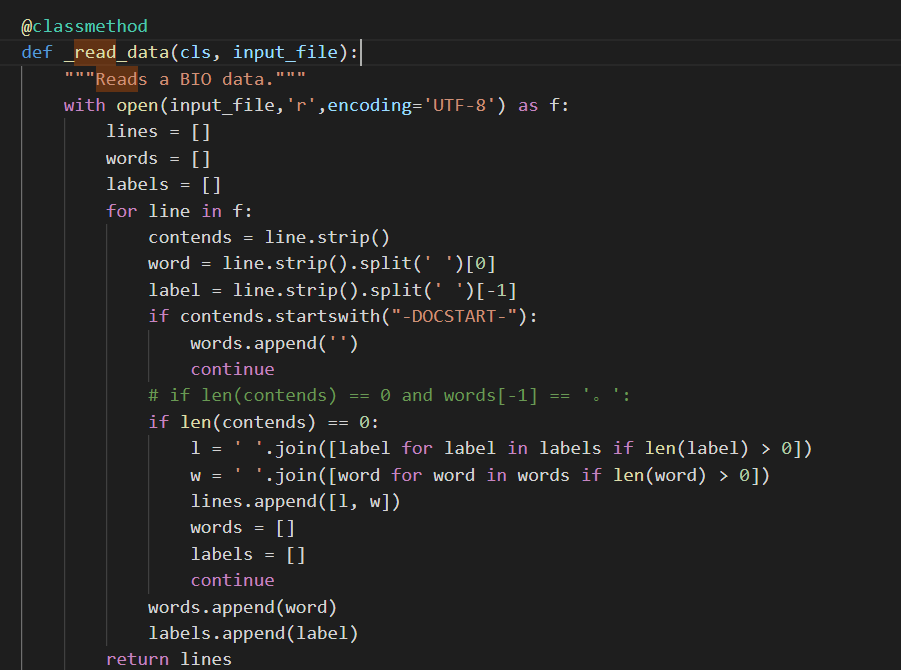

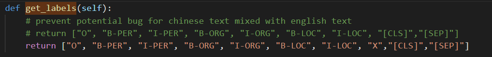

```python
def _create_example(self, lines, set_type):
  examples = []
  for (i, line) in enumerate(lines):
    guid = "%s-%s" % (set_type, i)
    text = tokenization.convert_to_unicode(line[1])
    label = tokenization.convert_to_unicode(line[0])

    examples.append(InputExample(guid=guid,   text=text, label=label))
  return examples
```

### 5 bert模型输入输出

BERT模型的主要输入是文本中各个字/词的原始词向量，该向量既可以随机初始化，也可以利用Word2Vector等算法进行预训练以作为初始值；输出是文本中各个字/词融合了全文语义信息后的向量表示。

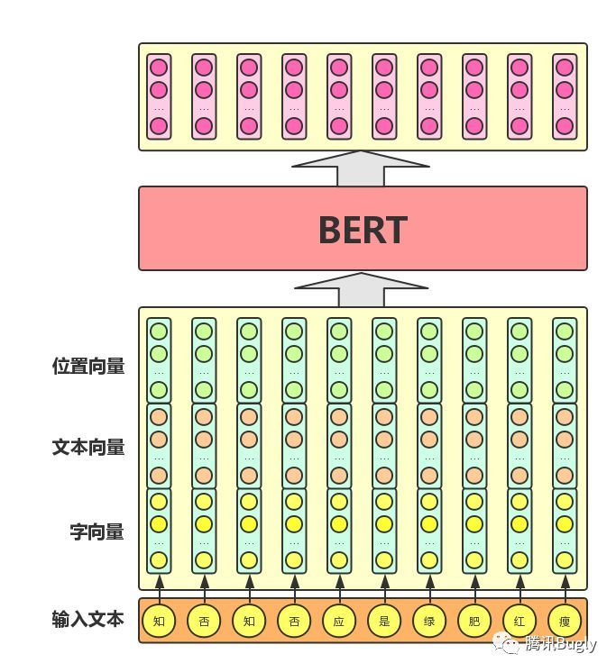


**注意**

输入 max_seq_length = 128  长短不一：超过128的舍去，不足的补0

**模型输入**


1. Token embedding 表示当前词的embedding

2. Segment Embedding 表示当前词所在句子的index embedding

3. Position Embedding 表示当前词所在位置的index embedding

BERT各组成部分含义，词向量（token embeddings）、段向量(segment embeddings)、位置向量(position embeddings)

**词向量**：是模型中关于词最主要的信息
**段向量**：是因为BERT里面的下一句的预测任务，所以会有两句拼接起来，上句与下句，上句有上句段向量，下句则有下句段向量，也就是图中A与B。此外，句子末尾都有加[SEP]结尾符，两句拼接开头有[CLS]符   单句子任务只有开头和结束分割标志      

头尾是[CLS]和[SEP]的向量

**位置向量**：Transformer 模型不能记住时序，需要人为加入表示位置的向量，之后这三个向量拼接起来的输入会喂入BERT模型，输出各个位置的表示向量

**模型输出**

bert模型的输出，使用 model.get_sequence_output()和model.get_pooled_output() 两个方法

针对中文ner任务，采用序列输出   output_layer = model.get_sequence_output()

可以获取每个token的output 输出[batch_size, seq_length, embedding_size] 

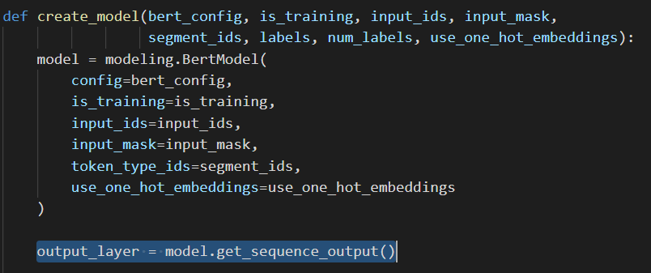

**fine-tuning操作**

当得到所有token的最后层transformer输出，喂给softmax层做分类。

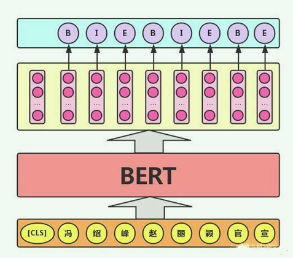

### 6 训练及预测用法

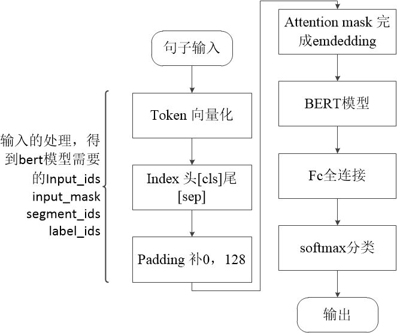

train训练

```python 
python BERT_NER.py --data_dir=data/ --bert_config_file=checkpoint/bert_config.json --init_checkpoint=checkpoint/bert_model.ckpt --vocab_file=vocab.txt --output_dir=./output/result_dir/
```
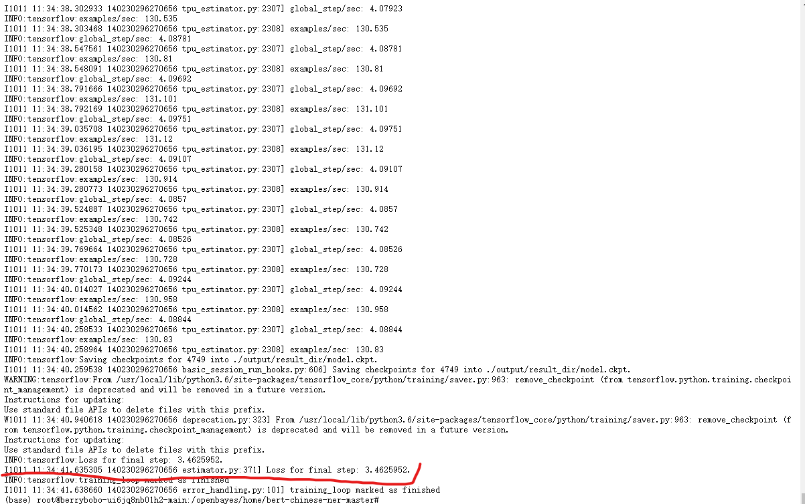

predict预测


```python
python BERT_NER.py --data_dir=data/ --bert_config_file=checkpoint/bert_config.json --init_checkpoint=checkpoint/bert_model.ckpt --vocab_file=vocab.txt --output_dir=./output/result_dir/ --do_train=False --do_eval=True --do_predict=True
```

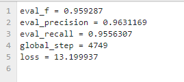

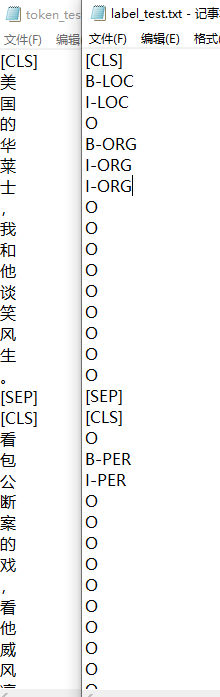


### 7 关系抽取RE

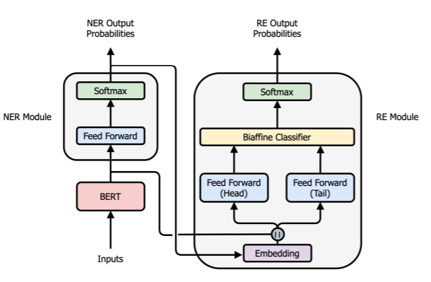

### 8 github相关项目

- [中文电子病例命名实体识别项目](https://github.com/liuhuanyong/MedicalNamedEntityRecognition)
- [中文命名实体识别，HMM，CRF，BiLSTM，BiLSTM+CRF的具体实现](https://github.com/luopeixiang/named_entity_recognition)
- [针对医疗数据进行命名实体识别](https://github.com/F-debug/Medical-named-entity-recognition)
- [短实体，长句实体抽取](https://github.com/StanleyLsx/entity_extractor_by_binary_tagging)
- [基于BERT的中文命名实体识别](https://github.com/xuanzebi/BERT-CH-NER#%E6%80%BB%E7%BB%93)
- [albert-chinese-ner使用预训练语言模型ALBERT做中文NER](https://github.com/ProHiryu/albert-chinese-ner)

### 9 博客

[基于BERT预训练的中文命名实体识别TensorFlow实现](https://blog.csdn.net/macanv/article/details/85684284)

[图解BERT模型：从零开始构建BERT](https://cloud.tencent.com/developer/article/1389555)

[bert代码解读2之完整模型解读](https://blog.csdn.net/qqywm/article/details/85454531?utm_medium=distribute.pc_relevant.none-task-blog-BlogCommendFromMachineLearnPai2-1.channel_param&depth_1-utm_source=distribute.pc_relevant.none-task-blog-BlogCommendFromMachineLearnPai2-1.channel_param)

[一文读懂BERT(原理篇)](https://blog.csdn.net/jiaowoshouzi/article/details/89073944)

